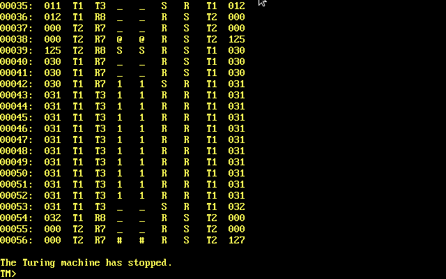

# AlanZ80X

**An extended Turing machine implementation**  

## About this implementation

_The AlanZ80X is an idea that takes the concept of a Turing machine to a new level. It may be possible, but it’s not certain that it will succeed. It might get made, but it's not certain. But I can say that it's great for fun. And to be challenging in the fun, it has to fit into 64kB._  

### In a nutshell 

This state machine differs from Turing's original model in several ways: it has four general and two special I/O tapes and some registers. But differs from traditional multi-tape machine, because it always handles only two tapes (and/or registers). It reads the one specified in the previous tuple and writes the one specified in the current tuple. The purpose and access mode of the general tapes are not specified. The machine will return to this setting after restarting.

The recommended setup defines a user data and program tape, a temporary tape, and a results tape. The machine has two additional special-purpose tapes: the stack and the other representing one of the standard output devices. Machine can write to output device: CON:, AUX:, LST:, PRN:, TRM: and if you are very lucky, how do you have PUN: instead of or in addition tape. But it can also be used as a pair of tapes, one as the data tape and the other as the marker tape for the data tape. You can also configure the way the tapes are accessed and the feedback method for failed readings. The tapes are represented by text files that are updated after each step. 

One register can be used arbitrarily and the others provide information about the current state of the machine. The purpose and permissions of the registers are predefined. The registers store data as a string of symbols, and can be specified in the tuple instead of a tape.

The machine also has a simple interrupt handling. The interrupt request is initiated by a keystroke.

The machine works only based on the status table. The machine's basic program (tuples), settings, and commands required for automated execution contained in t36 file. In the state change table, the basic program is divided into parts according to the number of instruction codes and interrupts on the program tape.

### How it works?

The framework is command-line controlled. The help provides information about the commands available on the command line. We can change the program's breakpoint, tracking, number of steps, symbol set, and the association of tapes and files. We can get various information about the machine, tapes, and registers. We can load the t36 file and run the machine even step by step.

Its operation is generally simple: the loaded t36 file contains all the data required for the machine to operate. After starting the machine, it determines the symbol to be printed and the next state based on the scanned symbol and the current state.

This process is not that simple in the default setting: after the machine starts, it starts reading the program tape (t2), then reads the corresponding data from the data tape (t1). The program and data tape now are read-only. During operations, the stack tape (t5), which acts as a traditional stack, the temporary tape (t4) and the accumulator register (r0) can also be used. The result tape (t3) is used to print the result. It is also possible to write to the console, but this is always write-only.

The state vectors for commands and interrupts are placed in two rows of the state table (jump tables). When an interrupt request is detected, the basic program jumps to the appropriate state and then acts accordingly.

Copyright (C) 2025 Pozsár Zsolt <pozsarzs@gmail.com>  

## Features

|features             |                                                     |
|---------------------|-----------------------------------------------------|
|version              |v0.1                                                 |
|licence              |EUPL v1.2                                            |
|architecture         |i86, Z80                                             |
|OS                   |CP/M and DOS                                         |
|compiler             |Borland Turbo Pascal v3.01a PC-DOS and CP/M-80 (1985)|
|framework            |                                                     |
| ~ user interface    |CLI                                                  |
| ~ language          |en                                                   |
| ~ commands          |17                                                   |
| ~ extras            |breakpoint, tracking                                 |
| ~ example programs  |1                                                    |
|state machine        |                                                     | 
| ~ commands          |number of symbols - 3                                |
| ~ interrupts        |number of symbols - 3                                |
| ~ registers         |1 general                                            |
|                     |8 status                                             |
|                     |1 special ('bottomless')                             |
| ~ state set         |up to 128 states                                     |
| ~ symbol set        |up to 40 characters (2 mandatory and 38 optional)    |
| ~ tapes             |1 virtual (to standard output)                       |
|                     |4 general                                            |
|                     |1 special (stack)                                    |
| ~ files             |base 'program' and settings (*.t36)                  |

## Screenshots

Startup screen  

Number Shift #1  

Number Shift #2  

## The mathematical model of the machine

### Formal description

$$
M = (Q, T, R, S, D, q_0, \delta), \text{ where the: }
$$

 - Q: finite state set,
 - T: finite tape set,
 - R: finite register set,
 - S: finite symbol set,
 - D: finite head moving direction set,
 - q0: initial state and
 - $\delta$: transition function.

### Transition function

$$
\delta: (Q \times (T \cup R) \times S) \rightarrow Q \times (T \cup R) \times S \times D
$$

Input:  current state, a selected data source (tape or register), and the symbol read from it.  
Output: new state, selected data target (tape or register), symbol to be written, and head movement.

## Machine of sets - sets of the machine

These are the machine's sets in alphabetical order, with indexed elements. Most elements of a set are abstract identifiers, but any elements that have a value are specified. This value is used in the t36 file and in program messages.

### Head movement direction set

Finite set of head movement directions is as follows:

$$
D = \\{ d_0, d_1, d_2 \\}, \text{ where the: }
$$

- d0 = L, it is the left direction,
- d1 = S, it is the stay here, 
- d2 = R, it is the right direction.

Left/right moves must be specified for all registers and tapes, but for some they are ineffective. The stack head moves independently, for single-symbol registers the head cannot move, for standard output it always moves right.

### Register set

The finite set of registers and the symbol chains on them are as follows:

$$
R = \\{ r_0, \dots, r_9 \\} \text{ and } w(t_n) \in S^*, \text{ where the: }
$$

- r0: Accumulator (ACC) - char type,
- r1: t1 Tape Position (1TP) - integer type,
- r2: t2 Tape Position (2TP) - integer type,
- r3: t3 Tape Position (3TP) - integer type,
- r4: t4 Tape Position (4TP) - integer type,
- r5: Stack Tape Position (STP) - integer type,
- r6: Program Step Counter (PSC) - integer type,
- r7: Bottomless Register (BLR) - char type,
- r8: Command Vector Register (CVR) - char type,
- r9: Interrupt Vector Register (IVR) - char type,
- w: Symbol chain in the register.

All register value are stored as string. Reading and writing is done in the same way as with tape. The bottomless register swallows the symbol written into it and always returns '_' when read.

### State set

The state is called an m-configuration in Turing terminology. The finite set of states is as follows:

$$
Q = \\{ q_0, \dots, q_{127} \\}, \text{ where the: }
$$

- q0, is the default initial state,
- q1-q124 are the free space,
- q125 is the command vector area,
- q126 is the interrupt vector area,
- q127 is the mandatory final state.

### Tape symbol set

Finite set of tape symbols is as follows:

$$
S = \\{ s_0, \dots, s_{39} \\}, \text{ where the: }
$$

- s0 is the mandatory blank character (_),
- s1 is the mandatory end character (#),
- s2 is the mandatory command character (@),
- s3-s40 are optional symbols.

The set must have at least three elements. To use registers, decimal numbers must also be included in the symbol set. Default symbol set is '_#@.-ABCDEFGHIJKLMNOPQRSTUVWXYZ0123456789'.

The tape files store data in human-readable form. Their content is updated with every change in status.

### Tape set

The finite set of tapes and the symbol chains on them are as follows:

$$
T = \\{ t_0, \dots, t_5 \\} \text{ and } w(t_n) \in S^*, \text{ where the: }
$$

- t0: standard output device of the OS (CON:, LST:, ...),
- t1-t4: general purpose tapes,
- t5: stack tape,
- w: Symbol chain on the tape.

By recommended setup:
- t0: redirected to the CON: device,
- t1: data tape,
- t2: program tape,
- t3: result tape,
- t4: temporary tape and
- t5: stack tape.

## Operation

The operation of the machine is based on state transitions, which can be described by tuples, in the form below. Operating modes determine the direction of read and write operations.

|mode|   initial   |     from    |      to     |    read     |    write    |    move     |     move    |            next           |    final    |                                                                              9-tuple                                                                |
|:--:|:-----------:|:-----------:|:-----------:|:-----------:|:-----------:|:-----------:|:-----------:|:-------------------------:|:-----------:|:---------------------------------------------------------------------------------------------------------------------------------------------------:|
| M1 |qi|tj|tk|sj|sk|dj|dk|tm/rm|qm|(qi, tj, tk, sj, sk, dj, dk, tm/rm, qm)|
| M2 |qi|tj|rk|sj|sk|dj|dk|tm/rm|qm|(qi, tj, rk, sj, sk, dj, dk, tm/rm, qm)|
| M3 |qi|rj|tk|sj|sk|dj|dk|tm/rm|qm|(qi, rj, tk, sj, sk, dj, dk, tm/rm, qm)|
| M4 |qi|rj|rk|sj|sk|dj|dk|tm/rm|qm|(qi, rj, rk, sj, sk, dj, dk, tm/rm, qm)|

Notes:  
- dj is the head moving direction over the input data carrier, dj $\in$ D,
- dk is the head moving direction over the result data carrier, dk $\in$ D,
- dj and dk cannot be 'S' at the same time,
- qi is the actual state, qi $\in$ Q,
- qm is the next state, qm $\in$ Q,
- rj is the register from which the machine reads a symbol, rj $\in$ R,
- rk is the the register to which the machine writes a symbol, rj $\in$ R,
- rm is the next register from which the machine reads a symbol, tm $\in$ R,
- sj is the actual symbol read from the data carrier, sj $\in$ S,
- sk is the symbol to be written to the data carrier, sk $\in$ S,
- tj is the tape from which the machine reads a symbol, tj $\in$ T,
- tk is the tape to which the machine writes a symbol, tj $\in$ T,
- tm is the next tape from which the machine reads a symbol, tm $\in$ T.

## Structure of files used by programs

### The t36 file

This file type is used to load the Turing machine's (base) program, define initial settings, and automate execution. The following table follows the structure of the file and provides a brief description of the lines.  

|Label                      |Description                   |Alanz80  |AlanZ80X |
|---------------------------|------------------------------|:-------:|:-------:|
|`; comment`                |comment                       |         |         |
|`PROG BEGIN`               |begin of program              |mandatory|mandatory|
|`NAME progname`            |program name                  |mandatory|mandatory|
|`SYMB _#@...`              |set of symbols                |mandatory|mandatory|
|`STAT 3`                   |number of states              |mandatory|   N/A   |
|`CARD BEGIN`               |begin of the card section     |mandatory|mandatory|
|`     STnnn ...`           |base program                  |mandatory|mandatory|
|`CARD END`                 |end of card section           |mandatory|mandatory|
|`TAPE BEGIN`               |begin of tape section         |optional |mandatory|
|`     INIT 2`              |initial tape                  |   N/A   |optional |
|`     SYMB 012345679`      |data tape content             |optional |   N/A   |
|`     SPOS 1`              |data tape start position      |optional |   N/A   |
|`     ECHO device:`        |assign device to output       |   N/A   |optional |
|`     TAP1 LO data.tap`    |assign file to general tape   |   N/A   |mandatory|
|`     TAP2 LO program.tap` |assign file to general tape   |   N/A   |mandatory|
|`     TAP3 SO result.tap`  |assign file to general tape   |   N/A   |mandatory|
|`     TAP4 NN temp.tap`    |assign file to general tape   |   N/A   |mandatory|
|`     STCK NN stack.tap`   |assign file to stack tape     |   N/A   |mandatory|
|`TAPE END`                 |end of tape section           |optional |mandatory|
|`COMM BEGIN`               |begin of command section      |optional |optional |
|`     ...`                 |command line commands         |optional |optional |
|`COMM END`                 |end of command section        |optional |optional |
|`PROG END`                 |end of program                |mandatory|mandatory|

Note:  
- This file type has limited use with the previous version of the Turing machine, the table provides guidance.
- If the starting symbols specified in the CONF section is not '_#@', then they will be inserted.
- The default value of the INIT option in TAPE section is 2 (tape t2).
- The line length of the t36 file is maximum 1024 characters.
- Tape access modes: LO/LS/SO/NN Load only/Load and save/Save only/None.
- The 9-tuples must be specified in the following form:

 `ST000 R7_RST2000 ...`, where the:  

'STnnn' is the state, where nnn is the state number. The following groups are tuples for state nnn. Meaning of the characters in the first tuple:

- qi = 000, it is the initial state,
- tj = not specified, at the start tj=t0, in the following it is the same as the tm of the previous tuple.,
- rk = R7, it is the bottomless register (BLR),
- sj = not specified, the symbol number is the same as the tuple number in this status line,
- sk = '_', it is the symbol to be written to result tape,
- dj = R, it is the head moving direction over tj tape,
- dk = S, it is the head moving direction in rk register,
- tm = T2, it is the 2nd general tape,
- qm = 000, it is the final state.

## Example program

The example program increments and decrements the digits of the numbers on the data tape according to the instructions on the program tape.

The program is represented by the files ns.t36 and the tapes are represented by the files ns_*.tap.

## Command line commands

The program can be controlled with the following command line commands.

|   |command                 |description                                       |
|--:|------------------------|--------------------------------------------------|
|  1|`break [state\|-]`      |set, get and reset breakpoint state (qb)             |
|  2|`echo [on\|off]`        |turn tape echo to standard output on and off         |
|  3|`help [command]`        |show command syntax                                  |
|  4|`info`                  |show all information about this machine              |
|  5|`intr [on\|off]`        |turn interrupt detection on and off                  |
|  6|`limit [steps\|-]`      |set, get and reset number of steps [1..32766]        |
|  7|`load filename.t36`     |load t36 file                                        |
|  8|`prog [from][to]`       |show program                                         |
|  9|`quit`                  |exit the program                                     |
| 10|`reg [index]`           |show register content [0..9]                         |
| 11|`reset`                 |reset program (cold reset)                           |
| 12|`restore`               |restore machine to original state (warm reset)       |
| 13|`run`                   |run machine                                          |
| 14|`step`                  |run machine step-by-step                             |
| 15|`symbol [symbols\|-]`   |set, get and reset symbol set (S)                    |
| 16|`tape [index][filename]`|show content or assign file or device to tape  [1..5]|
| 17|`trace [on\|off]`       |turn tracking on and off                             |
