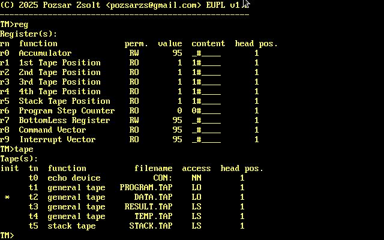

> [!WARNING]
> The program is still under development.  
>

# AlanZ80X

**An extended Turing machine implementation**  


## About this implementation

_The AlanZ80X is an idea that takes the concept of a Turing machine to a new level. It may be possible, but it’s not certain that it will succeed. It might get made, but it's not certain. But I can say that it's great for fun. And to be challenging in the fun, it has to fit into 64kB._  

### In a nutshell 

This state machine differs from Turing's original model in several ways: it has four general I/O tapes, a stack tape and some registers. Can write to standard output device (CON:, PRN:, LST:) instead of tape. The tapes are represented by typed files. One register can be used arbitrarily and the others provide information about the current state of the machine. The machine also has a simple interrupt handling. The interrupt request is initiated by flag files. The machine's basic program, settings, and commands required for automated execution contained in t36 file. In the state change table, the basic program is divided into parts according to the number of instruction codes and interrupts on the program tape.

### How it works?

The framework is command-line controlled. When the t36 file is loaded, the machine is initialized, the basic program is loaded, and - if specified - the commands are executed. After the machine starts, it starts reading the program tape (p36) and, if necessary, the data tape (d36). The program and data tape are read-only by default, but this can be overridden. During operations, the stack tape (s36), which acts as a traditional stack, the temporary tape (t36) and the accumulator register (ACC) can also be used. The result tape (r36) is used to print the result, which is by default read/write only. It is also possible to write to the console, but this is write-only. The result tape can be used in the same way as the single tape of a traditional Turing machine. The machine works only by reading and writing symbols and using state transitions.  

When an interrupt request is detected, the basic program jumps to the appropriate state and then acts accordingly. On a multitasking system, the signal file can be created by another program, but on CP/M and DOS we have to make do with the options provided by the framework system. A hot-key creates the file, which is handled by the running machine. (The machine does not handle the keystrokes.)

Copyright (C) 2025 Pozsár Zsolt <pozsarzs@gmail.com>  


## Features

|features                |                                                     |
|------------------------|-----------------------------------------------------|
|version                 |v0.1                                                 |
|licence                 |EUPL v1.2                                            |
|language                |en                                                   |
|user interface          |CLI                                                  |
|programming language    |Borland Turbo Pascal 3.x                             |
|architecture            |ix86, Z80                                            |
|OS                      |CP/M and DOS                                         |
|symbol set              |up to 40 characters                                  |
|state set               |up to 128 states                                     |
|interrupts              |4                                                    |
|registers               |9                                                    |
|source files            |base program and settings (*.t36)                    |
|                        |user program code (*.p36)                            |
|                        |user data (*.d36)                                    |
|                        |IRQ flags (*.i36)                                    |
|work files              |temporary tape (*.t36)                               |
|                        |stack tape - virtual memory (*.s36)                  |
|target files            |result tape (*.r36)                                  |
|built-in commands       |15 (can also be used in a program file)              |
|example program         |? scripts                                            |


## Screenshots

Startup screen  


Example #1  


## The mathematical model of the machine

### Formal description

$$
M = (Q, T, R, S, D, q_0, \delta), \text{ where the: }
$$

 - Q: finite state set,
 - T: finite tape set,
 - R: finite register set,
 - S: finite symbol set,
 - D: finite head moving direction set,
 - q<sub>0</sub>: initial state and
 - $\delta$: transition function.


### Transition function

$$
\delta: (Q \times (T \cup R) \times S) \rightarrow Q \times (T \cup R) \times S \times D
$$

Input:  current state, a selected data carrier (tape or register), and the symbol read from it.  
Output: new state, target data carrier (tape or register), symbol to be written, and head movement.


## Machine of sets - sets of the machine

These are the machine's sets in alphabetical order, with indexed elements. Most elements of a set are abstract identifiers, but any elements that have a value are specified. This value is used in the t36 file and in program messages.


### Data carriers set

This set is the union of the set of registers and the set of tapes. A register is not a true data carrier, but both are used for the same purpose, they only differ in their capacity.

$$
C = R /cup T, |C| = 14.
$$


### Head movement direction set

Finite set of head movement directions is as follows:

$$
D = \\{ d_0, d_1, d_2 \\}, \text{ where the: }
$$

- d<sub>0</sub> = L, it is the left direction,
- d<sub>1</sub> = S, it is the stay here, 
- d<sub>2</sub> = R, it is the right direction.

L/R movements applied to the ACC register are allowed but ineffective (they do not change the head position).

### Register set

The finite set of registers and the symbol chains on them are as follows:

$$
R = \\{ r_0, \dots, r_7 \\} \text{ and } w(t_n) \in S^*, \text{ where the: }
$$

- r<sub>0</sub>: Accumulator (ACC) - char type,
- r<sub>1</sub>: Data Tape Position (DTP) - integer type,
- r<sub>2</sub>: Program Tape Position (PTP) - integer type,
- r<sub>3</sub>: Result Tape Position (RTP) - integer type,
- r<sub>4</sub>: Stack Tape Position (STP) - integer type,
- r<sub>5</sub>: Temporary Tape Position (TTP) - integer type,
- r<sub>6</sub>: Program Step Counter (PSC) - integer type,
- r<sub>7</sub>: Instruction Register (IR) - byte type,
- w: Symbol chain in the register.

All register value are stored as string. Reading and writing is done in the same way as with tape.


### State set

The state is called an m-configuration in Turing terminology. The finite set of states is as follows:

$$
Q = \\{ q_0, \dots, q_{127} \\}, \text{ where the: }
$$

- q<sub>0</sub>, is the default initial state,
- q<sub>1</sub>-q<sub>124</sub> are the free space,
- q<sub>125</sub> is command vectors,
- q<sub>126</sub> interrupt vectors,
- q<sub>127</sub> is the mandatory final state.


### Tape symbol set

Finite set of tape symbols is as follows:

$$
S = \\{ s_0, \dots, s_{39} \\}, \text{ where the: }
$$

- s<sub>0</sub> is the mandatory blank character (_),
- s<sub>1</sub>-s<sub>39</sub> is are optional symbols.

The set has cardinality at least one, and its first element is always the blank
symbol.


### Tape set

The finite set of tapes and the symbol chains on them are as follows:

$$
T = \\{ t_0, \dots, t_5 \\} \text{ and } w(t_n) \in S^*, \text{ where the: }
$$

- t<sub>0</sub>: consol or output device: CON:, LST:, PUN:,
- t<sub>1</sub>: filename.d36, it is the data tape,
- t<sub>2</sub>: filename.p36, it is the user program tape,
- t<sub>3</sub>: filename.r36, it is the result tape,
- t<sub>4</sub>: filename.s36, it is the stack tape,
- t<sub>5</sub>: filename.t36, it is the temporary tape,
- w: Symbol chain on the tape.


## Operation

The operation of the machine is based on state transitions, which can be described by tuples, in the form below.

|mode|initial|from| to  |read|write|move|move| next  |final|                9-tuple               |
|:--:|:-----:|:--:|:---:|:--:|:---:|:--:|:--:|:-----:|:---:|:------------------------------------:|
| M1 |  qi   | tj | tk  | sj | sk  | dj | dk | tm/rm | qm  |(qi, tj, tk, sj, sk, dj, dk, tm/rm, qm)|	
| M2 |  qi   | tj | rk  | sj | sk  | dj | dk | tm/rm | qm  |(qi, tj, tk, sj, sk, dj, dk, tm/rm, qm)|	
| M3 |  qi   | rj | tk  | sj | sk  | dj | dk | tm/rm | qm  |(qi, tj, tk, sj, sk, dj, dk, tm/rm, qm)|	
| M4 |  qi   | rj | rk  | sj | sk  | dj | dk | tm/rm | qm  |(qi, tj, tk, sj, sk, dj, dk, tm/rm, qm)|	

Notes:  
- dj is the head moving direction over the input data carrier, dj in D,
- dk is the head moving direction over the result data carrier, dk in D,
- dj and dk cannot be 'S' at the same time,
- qi is the actual state, qi in Q,
- qm is the next state, qm in Q,
- rj is the register from which the machine reads a symbol, rj in C,
- rk is the the register to which the machine writes a symbol, rj in C,
- rm is the next register from which the machine reads a symbol, tm in C,
- sj is the actual symbol read from the data carrier, sj in S,
- sk is the symbol to be written to the data carrier, sk in S,
- tj is the tape from which the machine reads a symbol, tj in C,
- tk is the tape to which the machine writes a symbol, tj in C,
- tm is the next tape from which the machine reads a symbol, tm in C.


## Structure of files used by programs

### The t36 file

This file type is used to load the Turing machine's (base) program, define initial settings, and automate execution. The following table follows the structure of the file and provides a brief description of the lines.  

|Label                      |Description                   |Alanz80  |AlanZ80X |
|---------------------------|------------------------------|:-------:|:-------:|
|`; comment`                |comment                       |         |         |
|`PROG BEGIN`               |begin of program              |mandatory|mandatory|
|`NAME progname`            |program name                  |mandatory|mandatory|
|`SYMB 0123456789PROG`      |set of symbols                |mandatory|mandatory|
|`STAT 3`                   |number of states              |mandatory|mandatory|
|`CARD BEGIN`               |begin of the card section     |mandatory|mandatory|
|`     STnn ...`            |base program                  |mandatory|mandatory|
|`CARD END`                 |end of card section           |mandatory|mandatory|
|`TAPE BEGIN`               |begin of tape section         |optional |mandatory|
|`     SYMB 012345679`      |data tape content             |optional |   N/A   |
|`     SPOS 1`              |data tape start position      |optional |optional |
|`     CNSL WO devicename:` |assign device to console      |   N/A   |mandatory|
|`     DATA RO filename.d36`|assign file to data tape      |   N/A   |mandatory|
|`     PROG RO filename.p36`|assign file to program tape   |   N/A   |mandatory|
|`     STCK RW filename.s36`|assign file to stack tape     |   N/A   |mandatory|
|`     RSLT RW filename.r36`|assign file to result tape    |   N/A   |mandatory|
|`     TEMP RW filename.t36`|assign file to temporary tape |   N/A   |mandatory|
|`TAPE END`                 |end of tape section           |optional |mandatory|
|`COMM BEGIN`               |begin of command section      |optional |optional |
|`     ...`                 |command line commands         |optional |optional |
|`COMM END`                 |end of command section        |optional |optional |
|`PROG END`                 |end of program                |mandatory|mandatory|

Note:  
- This file type has limited use with the previous version of the Turing machine, the table provides guidance.
- If the first symbol specified in the CONF section is not blank, then it will be inserted.
- The 9-tuples must be specified in the following form:

 `ST001 t01t03abrlr02002 ...`, where the:  

- qi = 001, it is the initial state,
- tj = t01, it is the data tape,
- tk = t03, it is the result tape,
- sj = 'a', it is the read symbol from data tape,
- sk = 'b', it is the symbol to be written to result tape,
- dj = R, it is the head moving direction over data tape,
- dk = L, it is the head moving direction over result tape,
- rm = r02, it is the PTP register,
- qm = 002, it is the final state.

### Data format on tapes

The tape stores data in human-readable form.

|Type of tape  |Description       |Note                                 |Example content |
|--------------|------------------|-------------------------------------|----------------|
|data tape     |for input data    |not empty, created by the user       |`D36_1_123_5643`|
|program tape  |for user program  |not empty, created by the user       |`P36_1##_4#`    |
|result tape   |for output data   |created or overwritten by the program|`R36_123_511_1` |
|stack tape    |for stack         |created or overwritten by the program|`S36_23_54_12`  |
|temporary tape|for temporary data|created or overwritten by the program|`T36_23_54_12`  |


## Example program

```
; You can use this with AlanZ80X extended Turing machine implementation.
; The program turns on tracing after starting, then start machine. The machine
; reads the instructions from the program tape and the corresponding data from
; the data tape. It uses the stack tape and the result tape to perform the
; operations, the machine stops and the result is stored on the latter.
; After stopping, it loads a machine with a different configuration (represented
; by the next.t36 file and continues working with its result.

PROG BEGIN
NAME R2A
DESC Conversion between Roman and Arabic numerals 
SYMB 0123456789IVXLCDM
STAT 33
CARD BEGIN
     ST001 ... 
     ST002 ... 
     ... 
CARD END
TAPE BEGIN
     DATA RO data.d36
     PROG RO program.p36
     STCK RW stack.s36
     RSLT RW output.r36
TAPE END
COMM BEGIN
     TRACE ON
     RUN
     LOAD next.t36
COMM END
PROG END
```


## Command line commands

The program can be controlled with the following command line commands.

|   |command               |description                                  |
|--:|----------------------|---------------------------------------------|
|  1|`break [0..127\|-]`   |set, get and reset breakpoint state (qb)     |
|  2|`help [command]`      |help with using the program                  |
|  3|`info`                |show all information about this machine      |
|  4|`limit [10..32767\|-]`|set, get and reset number of steps           |
|  5|`load filename.t36`   |load t36 file                                |
|  6|`prog`                |show program                                 |
|  7|`quit`                |exit the program                             |
|  8|`reg [0..7]`          |show register content                        |
|  9|`reset`               |reset program                                |
| 10|`restore`             |restore machine to original state            |
| 11|`run [0..255]`        |run from data tape head position             |
| 12|`step [0..255]`       |run step-by-step from data tape head position|
| 13|`symbol [symbols\|-]` |set, get and reset symbol set (S)            |
| 14|`tape [1..5]`         |show tape content                            |
| 15|`trace [on\|off]`     |turn tracking on and off                     |

